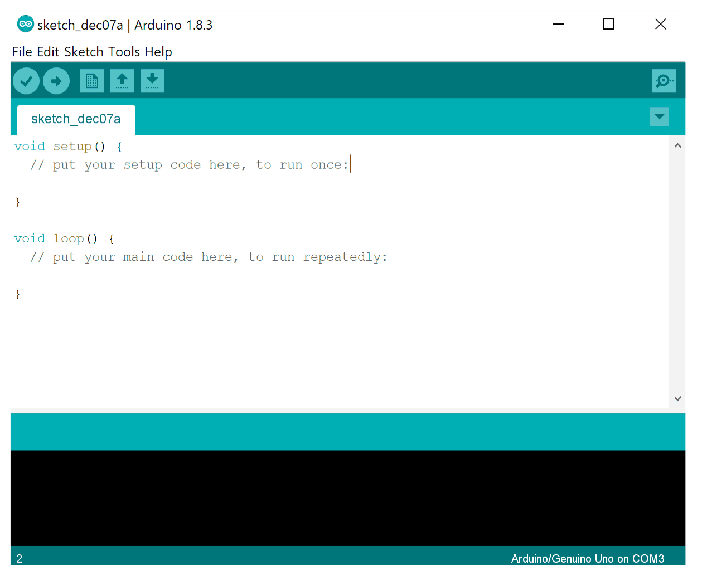

    <h1 align="center">Installing Arduino IDE</h1>

## What is Arduino IDE ?
- The Arduino Integrated Development Environment (IDE) is an open-source software specially designed for writing and compiling the code into the **Arduino development board**.
- It is surprisingly easy to code in Arduino’s IDE even if you don’t have any prior knowledge about the Arduino. If you know basic **C language** it would be very easy for you to master Arduino Programming.
- An Arduino code is called a `sketch`.

   

    

## The First Step
To get started, you must first download the **Arduino IDE** on your system. Depending upon your Operating System and Processor type there are different
versions of the software.

- To Download IDE from the official Website [Click Here](https://www.arduino.cc/en/software)
- For Step By Step procedure [Click Here](https://www.youtube.com/watch?v=TbHsOgtCMDc)

   

---

