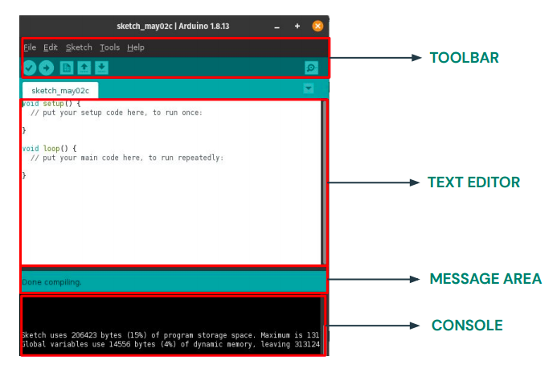
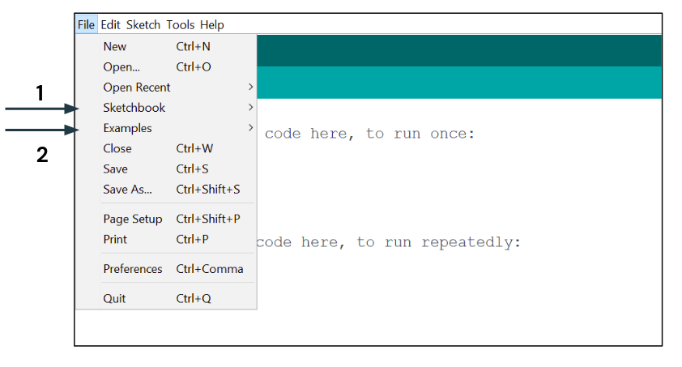
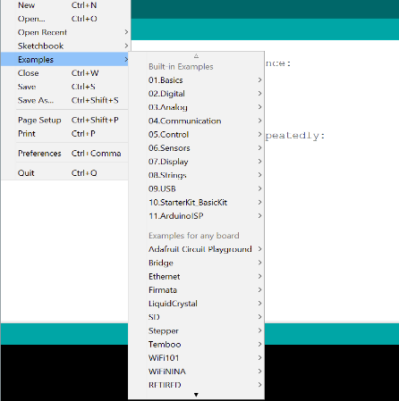
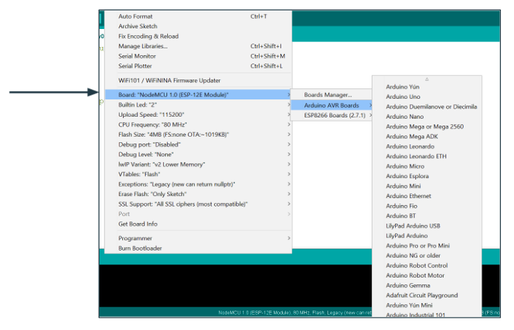
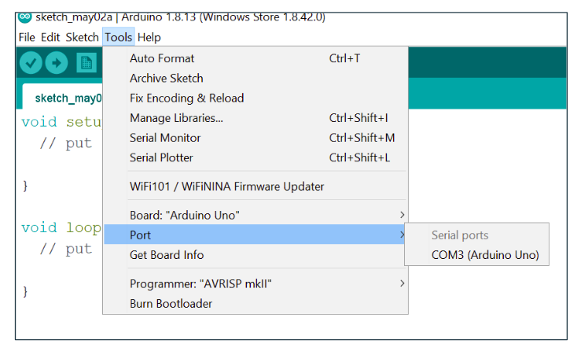

<p align="center">
    <h1 align="center">Arduino IDE : Interface</h1>
</p>

<h2 align = "center">Now when you are done with downloading the IDE, let’s understand the Interface...</h2>

<br /><br />

## Overview

- **Toolbar :** You can find options here to create/upload new files and to run/compile run your code.
- **Text Editor :** This is the place where you would write your code.
- **Message Area :** It is a one-line section of the Arduino IDE interface that displays quick messages about what's happening. Like `compiling...` or `error...`
- **Console :** Displays detailed output or error message.

<br />

<p align = "center">
    
</p>

<br /> <br />

## Main Menu

1. In sketchbook you can find the list of all the sketches/programs you have made
<br />
<p align = "center">
    
</p>

2. In Example Section you can find all the example programs related to installed libraries.
<br />
<p align = "center">
    
</p>

<br /> <br />

## Board Selection

1. Select your type of microcontroller from here.
2. For working with different version of a microcontroller you have to select it’s type first.
<br />
<p align = "center">
    
</p>

<br /> <br />

## Select Port

In case you attach more than one board, you need to select the correct port number.

```
Note : It is related to hardware, so if your are not working with hardware, you may skip it for now. 
```

<br />
<p align = "center">
    
</p>

<br /> <br />

<br /> <br />

---