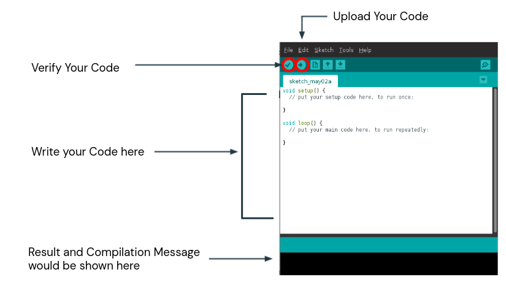
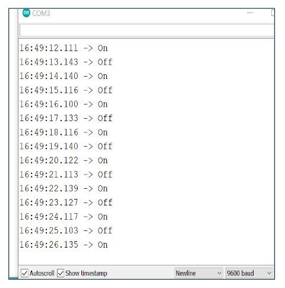

<p align="center">
    <h1 align="center">How to Execute Code?</h1>
</p>

<br /><br />

<p align = "center">
    
</p>

<br /><br />

## Input Code : 

```c

/*
   Blink
   Turns on an LED on for one second, then off for one second, repeatedly.
*/

// the setup function runs once when you press reset or power the board
void setup() {  
   Serial.begin(9600);
   pinMode(LED_BUILTIN, OUTPUT);
}

// the loop function runs over and over again forever
void loop() {
   digitalWrite(LED_BUILTIN, HIGH);
   Serial.println("On");
   delay(1000); 

   digitalWrite(LED_BUILTIN, LOW); 
   Serial.println("Off");
   delay(1000); 
}

````

<br /><br />

## Code Output on Serial Monitor :
<p align = "center">
    
</p>

<br /><br />


<p align = "center">If you got confused by <span style="font-family:monospace"> Serial.begin(9600)</span>, it is explained in the next section.</p>

---