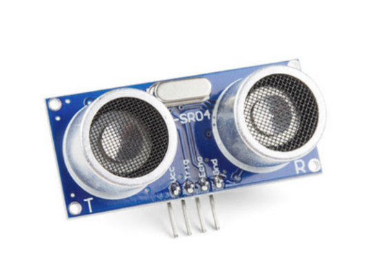
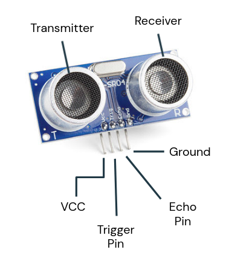

    <h1 align="center">Ultrasonic Sensor</h1>

 

    

 

- This sensor can be used to measure distances upto a certain range.
- Used in **SONAR** systems.
- The Transmitter emits ultrasonic waves & the Receiver receives the reflected waves from the target.
- As an output it will give us the time it took the sound wave to travel back and forth. Using the speed of sound we can calculate the distance of the object in front of it.

  

## Pin Description
 

    

 

This sensor has 4 Pins -

1. VCC : Connected to 5V pin on Arduino.  It provides power to the sensor.
2. GND : Connected to the Ground Pin on the arduino.
3. Trig Pin : Connected to any digital pin on arduino. It gives input to the sensor.
4. Echo Pin : Connected to any digital pin on the arduino. It gives output from sensor to the arduino.

  

    🔰 Distance finding Arduino code using Ultrasonic Sensor : 
    <a href = "https://github.com/Jumper-wires/Arduino-Projects/blob/main/Ultrasonic%20Sensor/Distance_Calculator/Distance_Calculator.ino
">
        Click Here
    </a>

  

---
