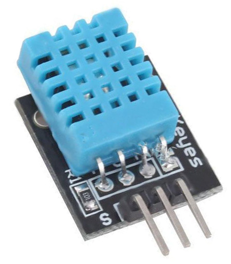
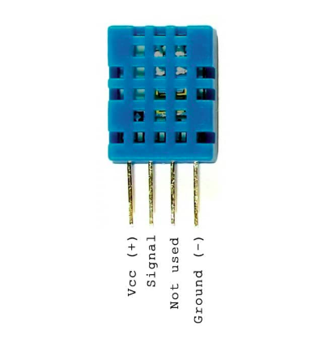

    <h1 align="center">Temperature and Humidity Sensor</h1>

 

DHT11 and DHT22 are sensors we used to measure temperature and humidity

  

    

  

## Pin Description
 

This sensor has 4 Pins -

1. **VCC** : connected to 5v
2. **DATA** : used for signal transferring
3. **NC** : not connected(ignore this pin)
4. **GND** :  connected to ground arduino.

  

    

  

    🔰 For understanding the difference between DHT11 and DHT22  
    <a href = "https://arduinogetstarted.com/tutorials/arduino-temperature-humidity-sensor">
        Click Here
    </a>

  

---
