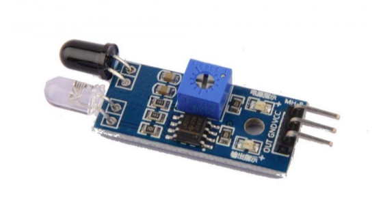
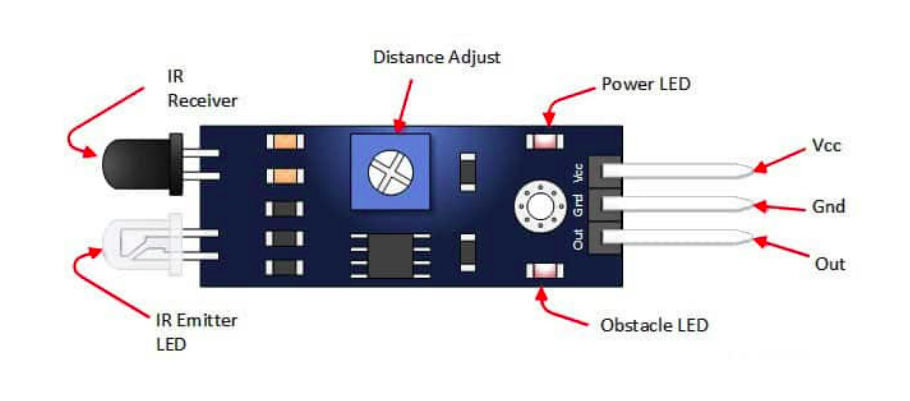

    <h1 align="center">Infrared Sensor</h1>

 

    

 

- This sensor has a transmitter and a receiver.
- The transmitter emits infrared radiations and if there is any object in front of the sensor that reflects the infrared radiations back to the receiver it will detect the change.
- If there is no object in front of the sensor it will always give an output of 1 or HIGH , but if the receiver receives infrared radiations, then its output changes to 0 or LOW.
- Interesting thing to note here is that fire also emits infrared radiations, so this sensor can also detect fire.

  

## Pin Description
 

    

  

    🔰 You can use IR Sensor in Gesture Control :  
    <a href = "https://drive.google.com/file/d/18L4DpFcmss9pPSBj7shDnryxR8TtwSLX/view?usp=sharing">
        Watch this Video
    </a>

  

---

