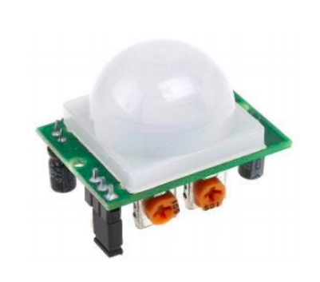
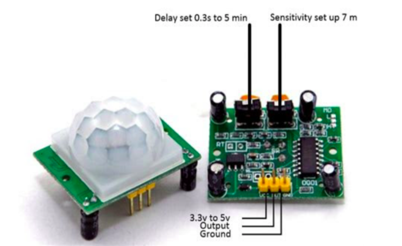
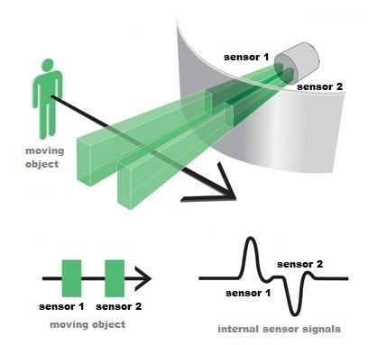

    <h1 align="center">Ultrasonic Sensor</h1>

 

    

 

- PIR sensor is used for detecting infrared heat radiations. This makes them useful in applications involving detection of moving living objects that emit infrared heat radiations.

- Passive infrared sensor, mainly used for detecting motion of human within its range.

- The output (in terms of voltage) of PIR sensor is high when it senses motion; whereas it is low when there is no motion (stationary object or no object).

  

## Pin Description

 

    

  

## PIR Principle

    

  

    🔰 More on PIR Sensor :  
    <a href = "https://robu.in/pir-sensor-working-principle/">
        [click here]
    </a>

  

---
