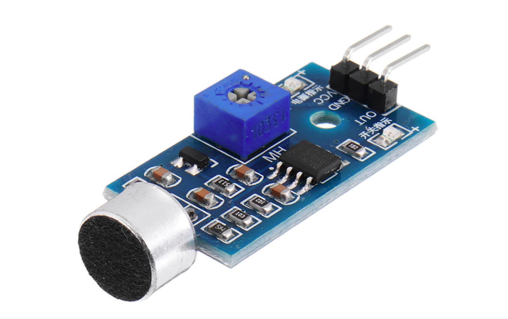

    <h1 align="center">Ultrasonic Sensor</h1>

 

A sound sensor is defined as a module that detects sound waves through its intensity and converting it to electrical signals

 

    

 

- Sound detection sensor module detects the intensity of sound where sound is detected via a microphone and fed into an LM393 op-amp. 

- It comprises an onboard potentiometer to adjust the setpoint for sound level.

- Sound Detection Sensor Module consists of four pins i.e. VCC, GND, DO, AO.

  

    🔰 Pin Connections and Arduino Code :   
    <a href = "https://www.youtube.com/watch?v=setjiVH0_IY">
        [click here]
    </a>

  

---
