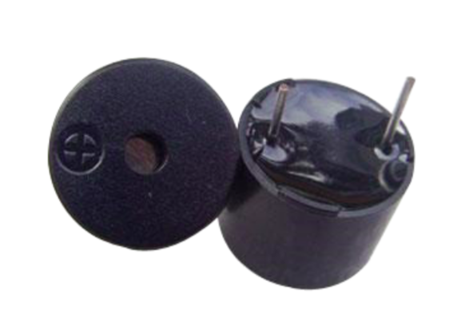

    <h1 align="center">Buzzer</h1>

 

There are 2 types of buzzers : Active and Passive

1. **Active Buzzer** generates the sound itself. You just have to connect the pins and turn the logic high and low similar to like you glow an LED.  

2. While for the **Passive Buzzer**, you will have to send the sound signal to control the sound. You will have to use the pwm pin to send the sound signal. It has various applications. You can use it to play music.

 

    

 

    🔰 How to distinguish Active Buzzer from the Passive Buzzer 
    <a href = "https://www.keliking.com/Differences-Between-Passive-Buzzer-and-Active-Buzzer-id570060.html">
        Click Here
    </a>

  

---

