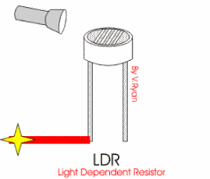
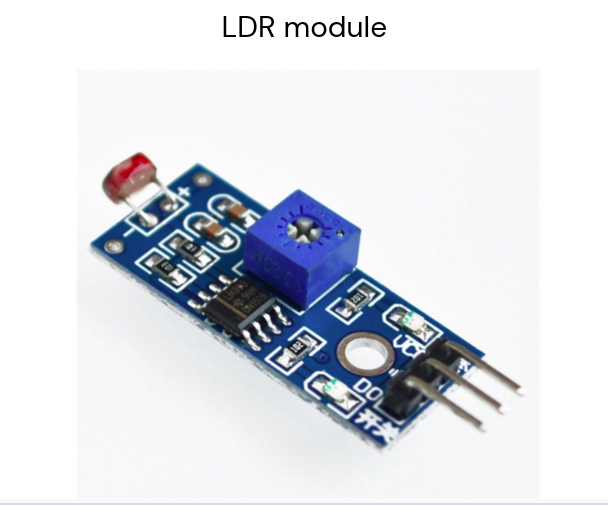
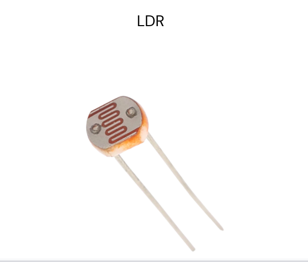

    <h1 align="center">Light Dependent Resistor</h1>

 

    

 

- A photoresistor or light dependent resistor is an electronic component that is sensitive to light. When light falls upon it, then the resistance changes

- Majority of the automatic light system in the street lights and in a number of indoor home appliances use LDR.

   

    
    

 

    🔰 Let’s try something with LDR :  
    <a href = "https://youtu.be/qKku-mmwNIA">
        Click Here
    </a>

  

---
