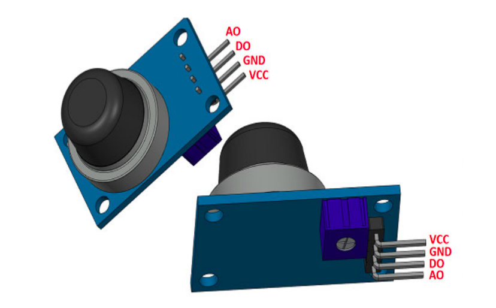

    <h1 align="center">Gas Sensor</h1>

 

    

 

- A gas sensor is a device which detects the presence or concentration of gases in the atmosphere.

- Based on the concentration of the gas the sensor produces a corresponding potential difference by changing the resistance of the material inside the sensor, which can be measured as output voltage. 

- Based on this voltage value the type and concentration of the gas can be estimated

  

## Pin Description

 

    

 

This sensor has 4 Pins -

1. **VCC** : Power supply

2. **GND** : Connected to Ground on Arduino

3. **DO** : Gives output as either 0 or 1 i.e. whether gas is present or not.

4. **AO** : Gives continuous output based on the concentration of gas that is applied to the gas
sensor

  

    <a href = "./9.%20Resources.md">
        🔰 Resources -> 
    </a>

  

---

