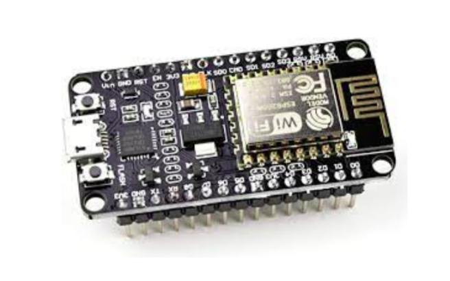
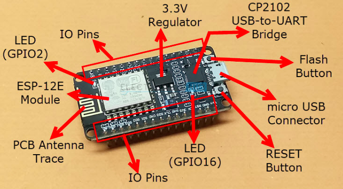

    <h1 align="center">NodeMCU</h1>

 

## Overview

The NODEMCU is an open-source firmware and development kit that helps you to prototype your IOT product within few C programming or Lua script lines.											

### POWER:
- Input Voltage : 3.3 V
- DC Current : 250mA							

### MEMORY :
- RAM : 32Kb
- DRAM : 80 Kb
- Flash : 200 Kb

  

    

  

## Some Quick Bits

- An Arduino like device
- Main component **ESP8266**
- With programmable pins
- And built in **WiFi**
- Power via USB
- Low cost

  

## Main Components : NodeMCU

  

    

  

---