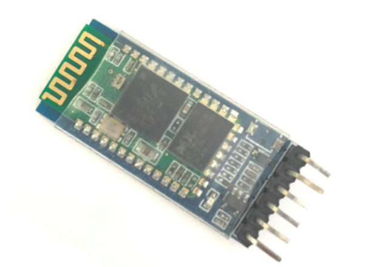
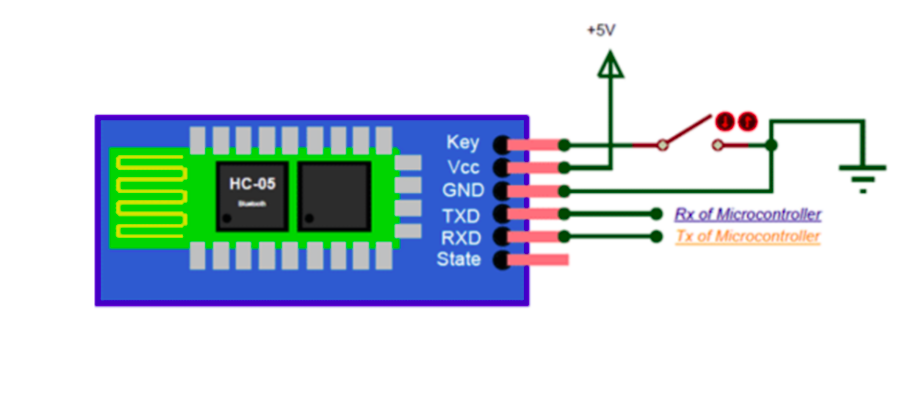

    <h1 align="center">Bluetooth Sensor (HC-05)</h1>

 

    

 

- The HC-05 is a very cool module which can add two-way (full-duplex) wireless functionality to your projects. 
- You can use this module to communicate between two microcontrollers like Arduino or communicate with any device with Bluetooth functionality like a Phone or Laptop. 
- There are many android applications that are already available which makes this process a lot easier.
- The module communicates with the help of USART at 9600 baud rate hence it is easy to interface with any microcontroller that supports USART.

  

## How to Use ?

 

    

 

- It is very easy to pair the this module with microcontrollers because it operates using the Serial Port Protocol.

- Simply power the module with +5V and connect the Rx pin of the module to the Tx of MCU and Tx pin of module to Rx of MCU as shown in the figure.

- **TIP** :- Remove the connection of tx and rx while uploading the code 

 

---