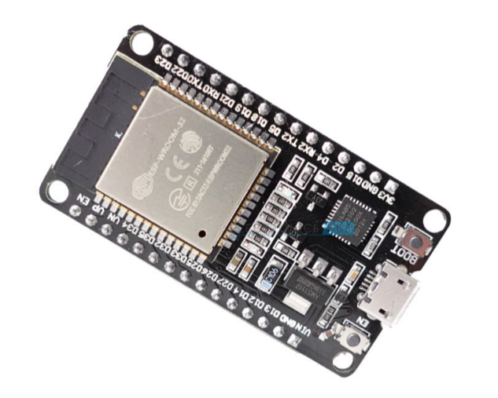
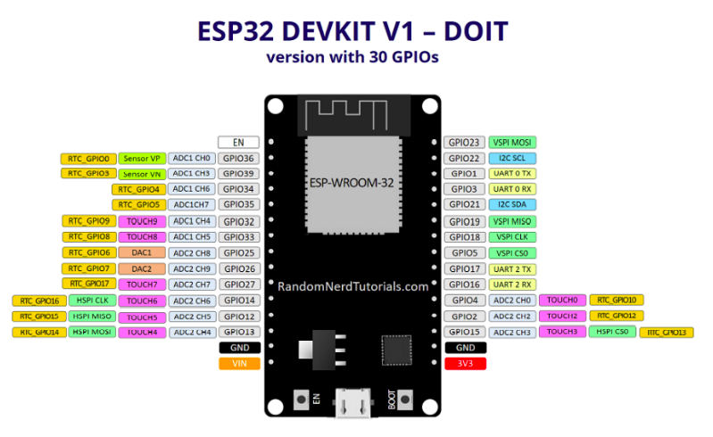

<p align="center">
    <h1 align="center">ESP32</h1>
</p>

<br />

<p align = "center">
    
</p>

<br />

- ESP32 is a series of low-cost power systems on a chip microcontroller. 
- The ESP32 is an advanced version of the ESP8266 series. (NodeMCU).
- The ESP32 series is created and developed by Espressif Systems. 
- It contain both wifi and Bluetooth module and the speed is faster then esp8266

```
There are many models of esp32 in market, you can even find one in which you can connect camera module  
```

<br />

## Difference b/w ESP8266 & ESP32

<br />

<table align = "center">
    <tr>
        <td>
            <b>ESP32</b>
         </td>
        <td>
            <b>NodeMCU (ESP8266)</b>
        </td> 
    </tr>
    <tr>
        <td>
            Bluetooth + Wifi both
        </td>
        <td>
            Only Wifi
        </td> 
    </tr>
    <tr>
        <td>
            160 Mhz clock frequency
        </td>
        <td>
            80 Mhz clock frequency
        </td> 
    </tr>
    <tr>
        <td>
            30-34 GPIO Pins
        </td>
        <td>
            17 GPIO Pins
        </td> 
    </tr>
    <tr>
        <td>
            12 bit Analog to Digital Convertor
        </td>
        <td>
            10 Bit Analog to Digital Convertor
        </td> 
    </tr>
    <tr>
        <td>
            Inbuilt Hall Sensor, Temperature Sensor
        </td>
        <td>
            No Inbuilt Sensor
        </td> 
    </tr>
    <tr>
        <td>
            CAN protocol for automotive communications
        </td>
        <td>
            No CAN protocol
        </td> 
    </tr>
</table>

<br />

## Pros 

- ESP32 offers you dual-core 160MHZ to 240MHZ
- You can control and monitor your device with the help of Wi-fi or Bluetooth at a very low price.
- ESP32 offers you more GPIOs
- ESP32 gives you a high speed of 150Mbps.

## Cons
- ESP32 is more expensive than the ESP8266

<br /><br />

## Pin Description

<br />

<p align = "center">
    
</p>


<br />
<br />

---


