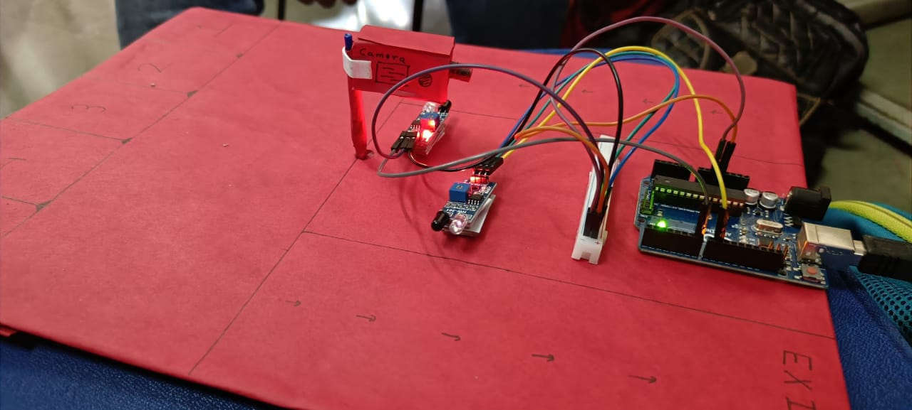
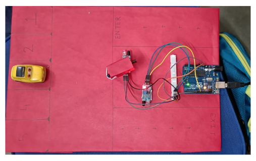

<h1>
Smart Car Parking System
</h1>

A smart parking system which displays the number of cars in the parking lot and wether or not to enter.

<h1>
Components Used
</h1>
<ul>
<li>IR Senosor</li>
<li>Arduino</li>
</ul>
